# WeChat

## 微信服务器的使用
 1. 下载微信服务器项目： [项目地址下载 WeChatServer](https://github.com/pan372728544/WeChatServer)
 2. 因为服务器包含了所有登录的用户信息数据库，所以这里要设置好数据库。项目中已经包含了数据库  文件 如下图:
 
 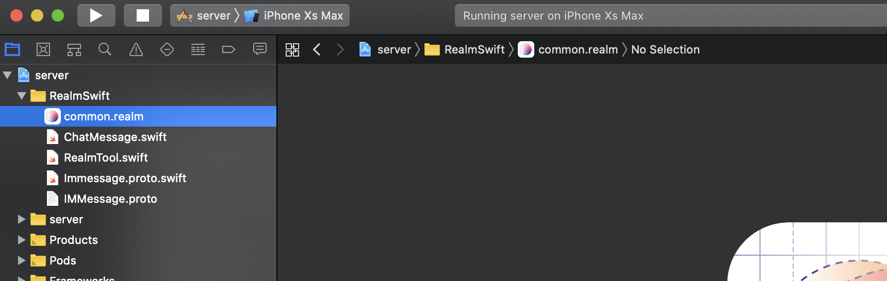
 
 3. 只需要把它放入工程项目的沙盒路径下的document文件中即可。如下图：


4. 在不同的模拟器中运行模拟器，运行起来之后服务器就启动了。


##  打开微信工程
1. 修改微信客户端的服务器地址。
   在代码中搜索 
   ``` swift
   let socketClient : ZJSocket = ZJSocket(addr: "10.2.116.47", port: 9999)
   ``` 
   修改其中的ip地址为微信服务器运行的ip地址。
 
2. 运行微信，会弹出登录页面
 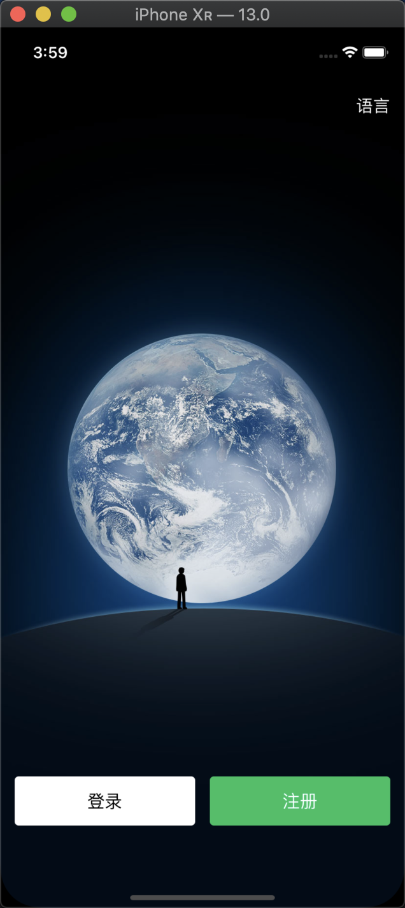
 
3. 服务器数据库查找登录的手机号
  我们在common.realm文件中打开数据库文件：
  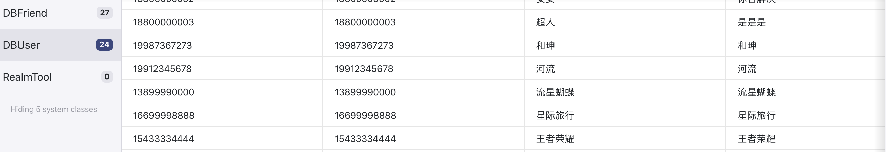
  在其中的DBUser文件中随便输入一个数据库中存在的手机号，输入手机号就可以登录成功了。
4. 登录
   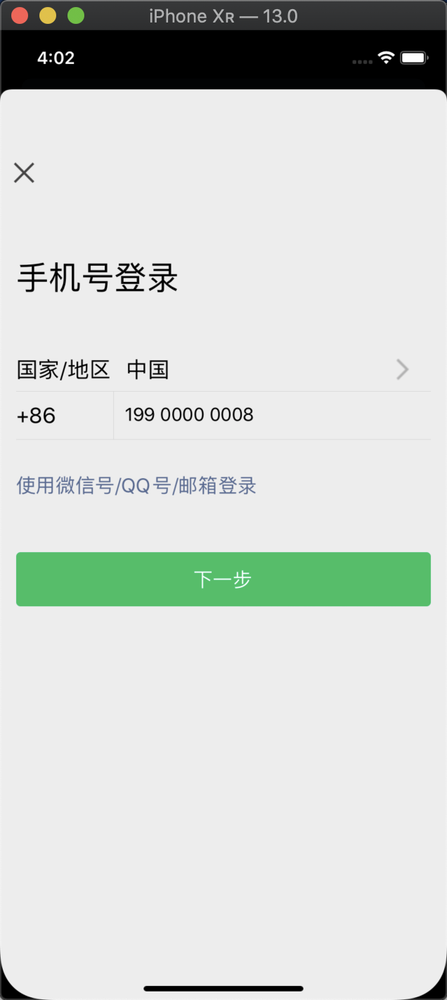
   
5. 登录成功后的页面
   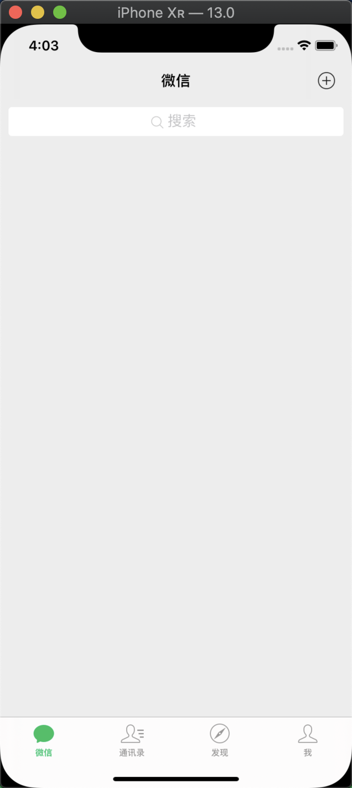 
   
6. 这是第一次登录，没有聊天数据，我们选择通讯录，在服务器获取通讯录数据，点击其中的一个好友就可以进行聊天了。

   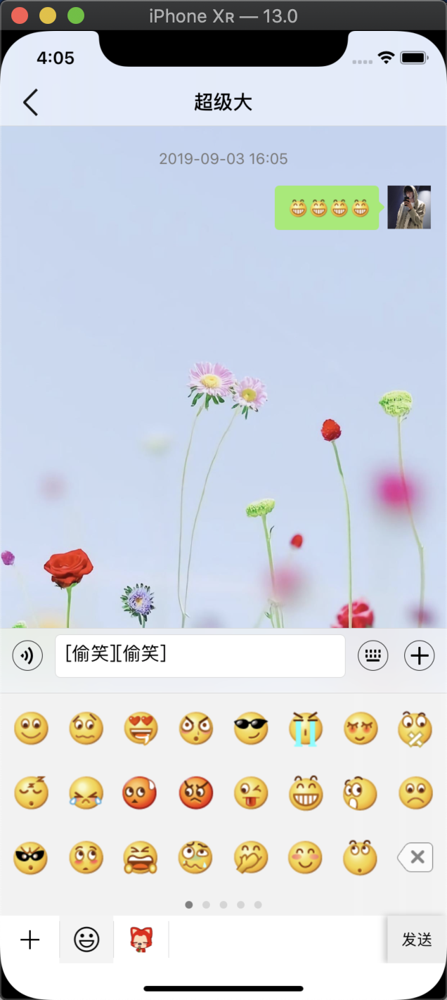   
   
7. 返回首页的时候就会有聊天记录了，聊天数据都保存在本地数据库的。
      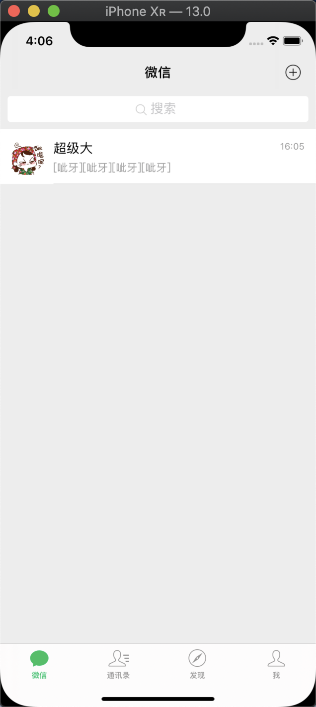  
      
      
## 实现的功能主要截图
   
   1. 下拉进入小程序    
   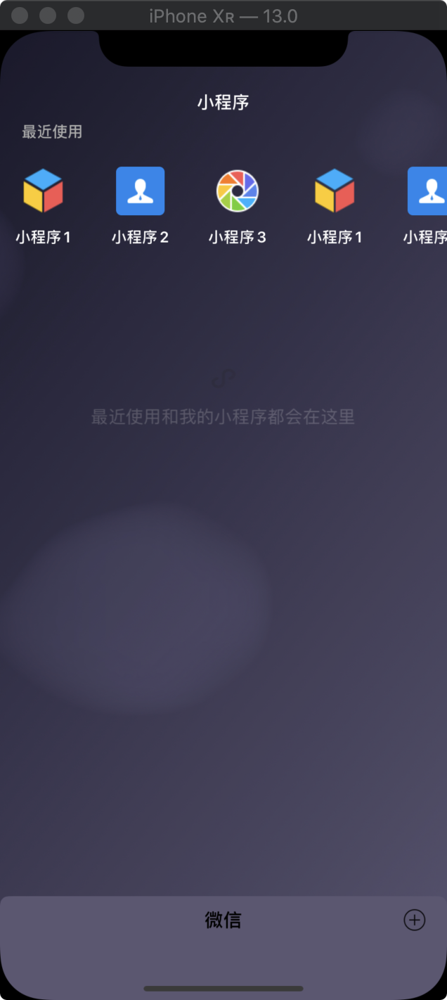  
   
   2. 通讯录的功能展示
   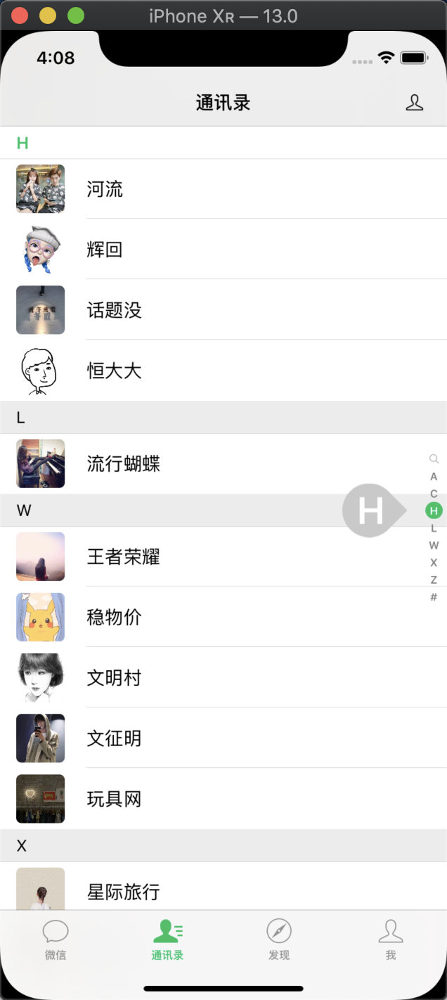  
      
   3. 朋友圈的功能   
     
            
   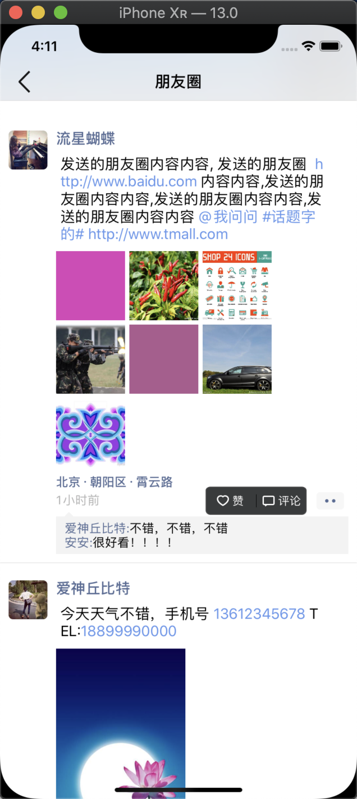  
     
   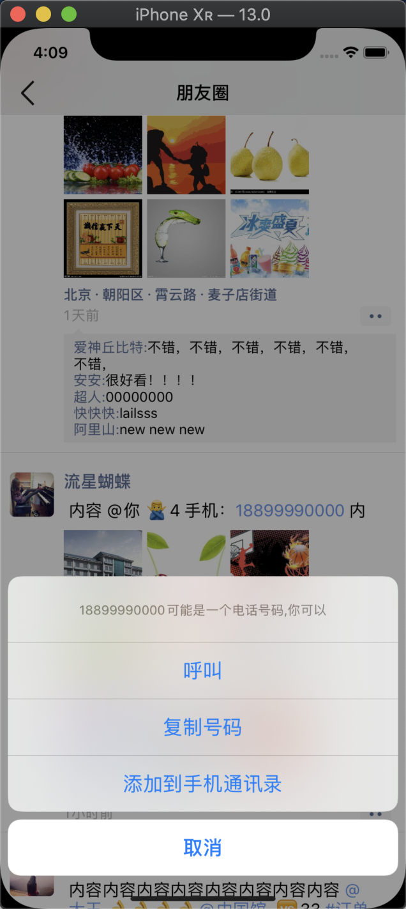 
   
   4. 我的页面下来拍视频动态 
   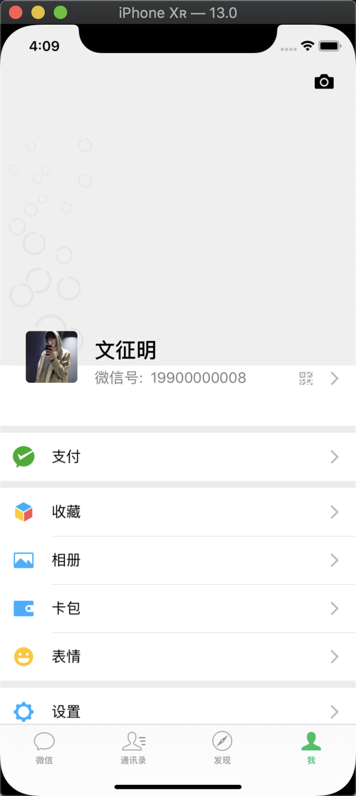  
   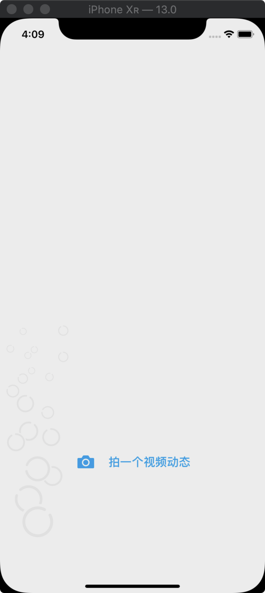  

  5. 我的聊天页面键盘展示
   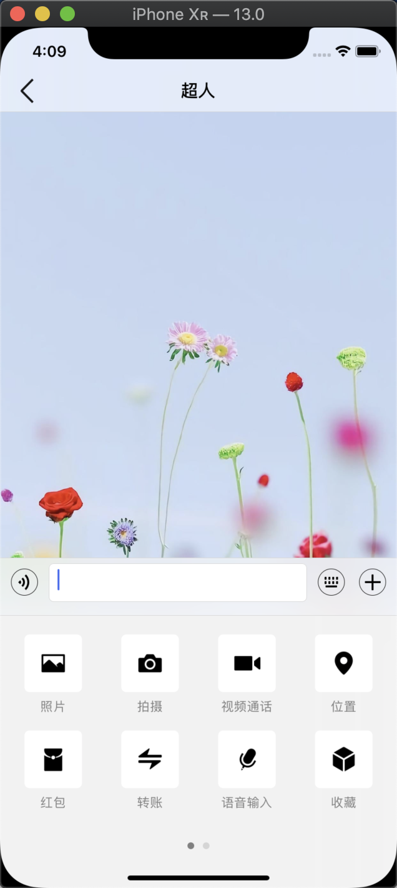  
   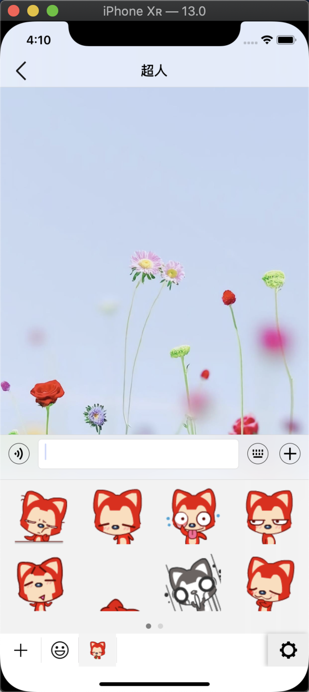  


 
   
 